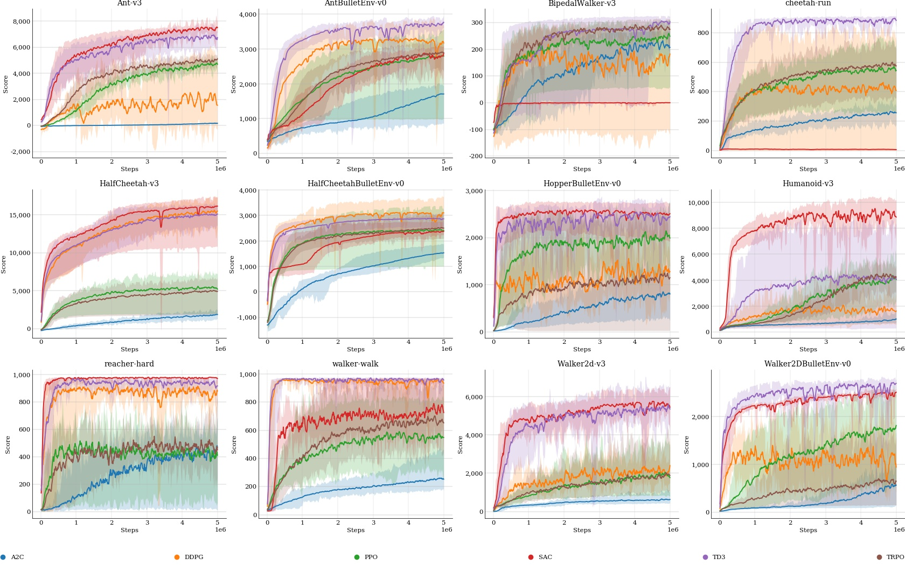

# Tonic

<div align="center">
  <br><br>
</div>

Welcome to the Tonic deep reinforcement learning library.

The main design principles are:

* **Modularity:** Building blocks for creating RL agents, such as models,
replays, or exploration strategies, are implemented as configurable modules.

* **Readability:** Agents are written in a simple way with an identical API and
logs are nicely displayed on the terminal with a progress bar.

* **Fair comparison:** The training pipeline is unique and compatible with all
Tonic agents and environments. Agents are defined by their core ideas while
general tricks/improvements like
[non-terminal timeouts](https://arxiv.org/pdf/1712.00378.pdf),
observation normalization and action scaling are shared.

* **Benchmarking:** Benchmark data of the provided agents trained on
[70 continuous control environments](https://github.com/fabiopardo/tonic_data/blob/master/images/benchmark.pdf)
are provided for direct comparison.

* **Wrapped popular environments:** Environments from
[OpenAI Gym](https://github.com/openai/gym),
[PyBullet](https://github.com/bulletphysics/bullet3) and
[DeepMind Control Suite](https://github.com/deepmind/dm_control) are made
compatible with
[non-terminal timeouts](https://arxiv.org/pdf/1712.00378.pdf) and synchronous
distributed training.

* **Compatibility with different ML frameworks:** Both TensorFlow 2 and PyTorch
are currently supported. Simply import `tonic.tensorflow` or `tonic.torch`.

* **Experimenting from the console:** While launch scripts can be used,
iterating over various configurations from a console is made possible using
snippets of Python code directly.

* **Visualization of trained agents:** Experiment configurations and
checkpoints can be loaded to play with trained agents.

* **Collection of trained models:** To keep the main Tonic repository light,
the full logs and trained models from the benchmark are available in the
[tonic_data repository](https://github.com/fabiopardo/tonic_data).

# Instructions

## Install from source

Download and install Tonic:
```bash
git clone https://github.com/fabiopardo/tonic.git
pip install -e tonic/
```

Install TensorFlow or PyTorch, for example using:
```bash
pip install tensorflow torch
```

## Launch experiments

Use TensorFlow or PyTorch to train an agent, for example using:
```bash
python -m tonic.train \
--header 'import tonic.torch' \
--agent 'tonic.torch.agents.PPO()' \
--environment 'tonic.environments.Gym("BipedalWalker-v3")' \
--name PPO-X \
--seed 0
```

Snippets of Python code are used to directly configure the experiment. This is
a very powerful feature allowing to configure agents and environments with
various arguments or even load custom modules without adding them to the
library. For example:
```bash
python -m tonic.train \
--header "import sys; sys.path.append('path/to/custom'); from custom import CustomAgent" \
--agent "CustomAgent()" \
--environment "tonic.environments.Bullet('AntBulletEnv-v0')" \
--seed 0
```

By default, environments use non-terminal timeouts, which is particularly
important for locomotion tasks. But a time feature can be added to the
observations to keep the MDP Markovian. See the
[Time Limits in RL](https://arxiv.org/pdf/1712.00378.pdf) paper for more
details. For example:
```bash
python -m tonic.train \                                                                                  ⏎
--header 'import tonic.tensorflow' \
--agent 'tonic.tensorflow.agents.PPO()' \
--environment 'tonic.environments.Gym("Reacher-v2", terminal_timeouts=True, time_feature=True)' \
--name PPO-time-aware \
--seed 0
```

Distributed training can be used to accelerate learning. In Tonic, groups of
sequential workers can be launched in parallel processes using for example:
```bash
python -m tonic.train \
--header "import tonic.tensorflow" \
--agent "tonic.tensorflow.agents.PPO(replay=tonic.replays.Segment(size=10000, batch_size=2000, batch_iterations=30))" \
--environment "tonic.environments.Gym('HalfCheetah-v3')" \
--trainer "tonic.Trainer(epoch_steps=100000)" \
--parallel 10 \
--sequential 100 \
--name PPO-10x100 \
--seed 0
```

## Plot results

During training, the experiment configuration, logs and checkpoints are
saved in `environment/agent/seed/`.

Result can be plotted with:
```bash
python -m tonic.plot --path BipedalWalker-v3/ --show True --baselines all
```
Regular expressions like `BipedalWalker-v3/PPO-X/0`,
`BipedalWalker-v3/{PPO*,DDPG*}` or `*Bullet*` can be used to point to different
sets of logs.
If the `--show` argument is not used, a window does not appear and results are
only saved in pdf or png files.
The `--baselines` argument can be used to load logs from the benchmark. For
example `--baselines all` uses all agents while `--baselines A2C PPO TRPO` will
use logs from A2C, PPO and TRPO.

Different headers can be used for the x and y axes, for example to compare the
gain in wall clock time of using distributed training, replace `--parallel 10`
with `--parallel 5` and `--name PPO-10x100` with `--name PPO-5x100` in the
last training example and plot the result with:
```bash
python -m tonic.plot --path HalfCheetah-v3/ --show True --x_axis train/seconds --x_label Seconds
```

## Play with trained models

After some training time, checkpoints are generated and can be used to play
with the trained agent:
```bash
python -m tonic.play --path BipedalWalker-v3/PPO-X/0
```

Environments are rendered using the appropriate framework. For example, when
playing with DeepMind Control Suite environments, policies are loaded in a
`dm_control.viewer` where `Space` is used to start the interaction, `Backspace`
is used to start a new episode, `[` and `]` are used to switch cameras and
double click on a body part followed by `Ctrl + mouse clicks` is used to add
perturbations.

## Play with models from tonic_data

The `tonic_data` repository can be downloaded with:
```bash
git clone https://github.com/fabiopardo/tonic_data.git
```

The best seed for each agent is stored in `environment/agent` and can be
reloaded using for example:
```bash
python -m tonic.play --path tonic_data/tensorflow/humanoid-stand/TD3
```

<div align="center">
  <br><br>
</div>

The full benchmark plots are available
[here](https://github.com/fabiopardo/tonic_data/blob/master/images/benchmark.pdf).

They can be generated with:
```bash
python -m tonic.plot --baselines all --name benchmark --columns 5
```

Or:
```bash
python -m tonic.plot --path tonic_data/tensorflow --name benchmark --columns 5
```

And a selection can be visualized with:
```bash
python -m tonic.plot \
--path tonic_data/tensorflow/{Ant-v3,AntBulletEnv-v0,BipedalWalker-v3,cheetah-run,HalfCheetah-v3,HalfCheetahBulletEnv-v0,HopperBulletEnv-v0,Humanoid-v3,reacher-hard,walker-walk,Walker2d-v3,Walker2DBulletEnv-v0} \
--name selection \
--columns 4
```

<div align="center">
  <br><br>
</div>

# Credit

## Other code bases

Tonic was inspired by a number of other deep RL code bases. In particular,
OpenAI Baselines and Spinning Up in Deep RL were used as starting points for
much of this library.

## Citing Tonic

If you use Tonic in your research, please cite:

```
@misc{tonic2020,
  author={Pardo, Fabio},
  title={Tonic RL Library},
  year={2020},
  publisher={GitHub},
  journal={GitHub repository},
  howpublished={\url{https://github.com/fabiopardo/tonic}},
}
```
